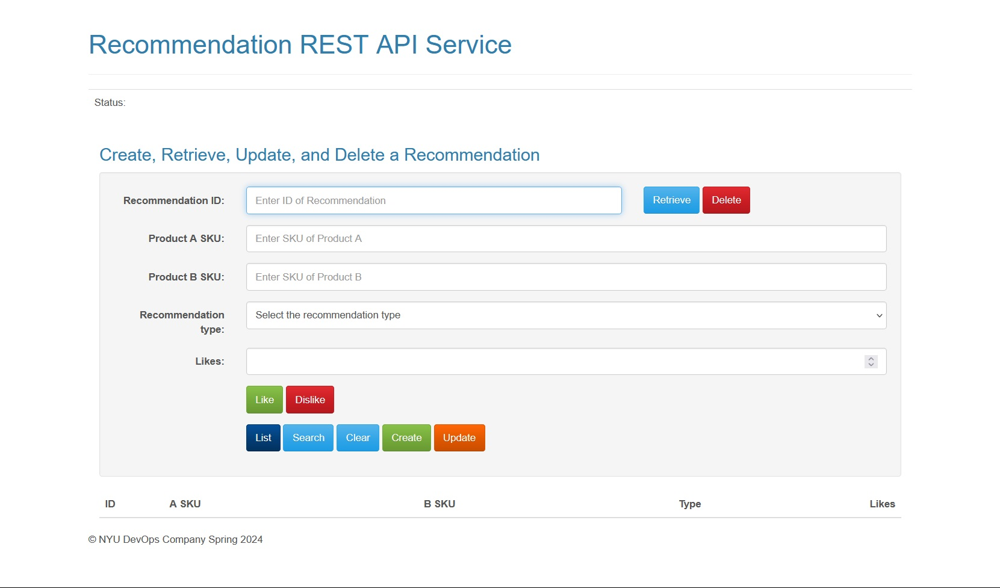

# NYU DevOps SP24 Project -- Recommendations Squad

[](https://opensource.org/licenses/Apache-2.0)
[](https://python.org/)
[](https://github.com/CSCI-GA-2820-SP24-003/recommendations/actions)
[](https://github.com/CSCI-GA-2820-SP24-003/recommendations/actions)
[](https://codecov.io/gh/CSCI-GA-2820-SP24-003/recommendations)

The project is based on [NYU DevOps Project Template](https://github.com/nyu-devops/project-template)

The TDD testing (pytest) is based on [NYU DevOps Lab Flask TDD](https://github.com/nyu-devops/lab-flask-tdd)

The k8s templates are based on [NYU DevOps Lab Kubernetes](https://github.com/nyu-devops/lab-kubernetes)

The BDD testing (behave) is based on [NYU DevOps Lab Flask BDD](https://github.com/nyu-devops/lab-flask-bdd)

## Overview

This course project is the backend for an eCommerce website as a collection of RESTful services. The class is divided into 9 squads, and each squad develops and runs a service end-to-end. This repo belongs to the Recommendations Squad who is responsible for managing relationships between two products.

## Contents

The repo contains the following:

```text
.gitignore          - this will ignore vagrant and other metadata files
.flaskenv           - Environment variables to configure Flask
.gitattributes      - File to gix Windows CRLF issues
.devcontainers/     - Folder with support for VSCode Remote Containers
dot-env-example     - copy to .env to use environment variables
pyproject.toml      - Poetry list of Python libraries required by your code

service/                   - service python package
├── __init__.py            - package initializer
├── config.py              - configuration parameters
├── models.py              - module with business models
├── routes.py              - module with service routes
└── common                 - common code package
    ├── cli_commands.py    - Flask command to recreate all tables
    ├── error_handlers.py  - HTTP error handling code
    ├── log_handlers.py    - logging setup code
    └── status.py          - HTTP status constants

tests/                     - test cases package
├── __init__.py            - package initializer
├── test_cli_commands.py   - test suite for the CLI
├── test_models.py         - test suite for business models
└── test_routes.py         - test suite for service routes
```

## Database Table Schema

| Column | Description |
| ------ | ----------- |
| id | Integer, serves as the primary key |
| likes | Integer no less than 0, reflects the popularity of a recommendation |
| product_a_sku |  String with no more than 10 characters, can not be null, represents product a |
| product_b_sku |  String with no more than 10 characters, can not be null, represents product b |
| recommendation_type | one of {"UP_SELL", "CROSS_SELL", "ACCESSORY", "BUNDLE"}, denotes the relationship between product a and product b |

### Example Object

```Python
{'id': 526, 'likes': 0, 'product_a_sku': 'HYJtLnYf', 'product_b_sku': 'cUnyEDwP', 'recommendation_type': 'CROSS_SELL'}
```

## Administration Frontend



### Buttons

#### Retrieve

Retrieves the Recommendation with the given `id`.

#### Delete

Deletes the Recommendation with the given `id`.

#### Like

Increments the `likes` field of the Recommendation with the given `id` by 1.

#### Dislike

Decrements the `likes` field of the Recommendation with the given `id` by 1. Likes cannot be lower than 0.

#### List

Retrieves all Recommendations from the database.

#### Search

Retrieves all Recommendations whose `product_a_sku` and / or `recommendation_type` match the input.

#### Clear

Clears all inputs.

#### Create

Creates a Recommendation in the database with the given `product_a_sku`, `product_b_sku`, `recommendation_type` and `likes`. The `id` and `likes` are automatically managed by the database.

## Implemented Endpoints

The root URL returns the administration frontend described above.

### GET "/recommendations"

Returns all of the Recommendations.

### POST "/recommendations"

Creates a Recommendation based on the data in the posted body.

### GET "/recommendations/\<int:recommendation_id\>"

Retrieves a single Recommendation based on the id.

### DELETE "/recommendations/\<int:recommendation_id\>"

Deletes a Recommendation based on the id specified in the path.

### PUT "/recommendations/\<int:recommendation_id\>"

Updates a Recommendation based on the posted body.

### PUT "/recommendations/\<int:recommendation_id\>/like"

Increments likes for a Recommendation.

### DELETE "/recommendations/\<int:recommendation_id\>/like"

Decrement likes for a Recommendation.

## License

Copyright (c) 2016, 2024 [John Rofrano](https://www.linkedin.com/in/JohnRofrano/). All rights reserved.

Licensed under the Apache License. See [LICENSE](LICENSE)

This repository is part of the New York University (NYU) masters class: **CSCI-GA.2820-001 DevOps and Agile Methodologies** created and taught by [John Rofrano](https://cs.nyu.edu/~rofrano/), Adjunct Instructor, NYU Courant Institute, Graduate Division, Computer Science, and NYU Stern School of Business.
